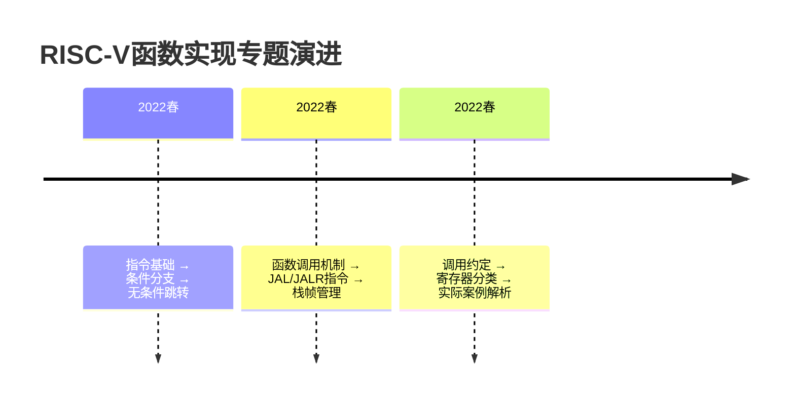
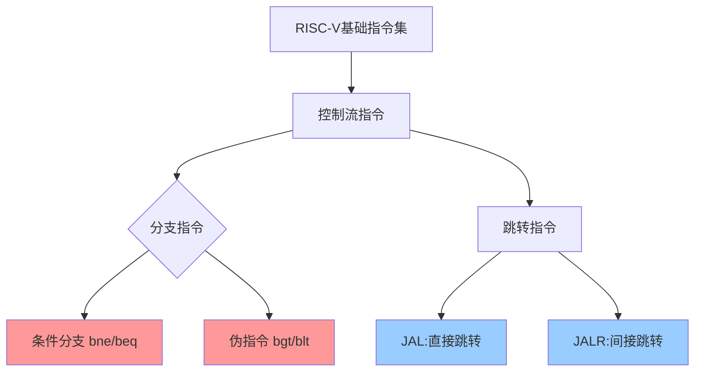
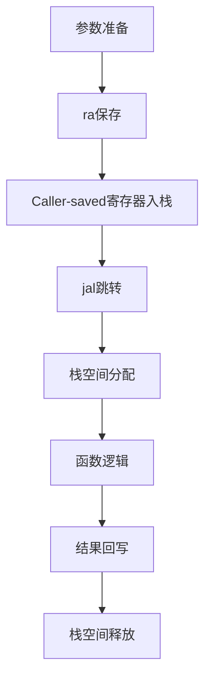

# lec07-RISCV指令基础-学习笔记

## 1. 课程脉络


>[!tip] 关键关联：
- `条件分支[←P4]` → `函数跳转[←P10]`
- `栈指针[←P28]` → `调用约定[←P35]`

## 2. 理论框架
### 基础假设
1. 寄存器存储模型：32位通用寄存器可存指针/整型数据（P2）
2. 程序计数器(PC)线性增长机制：`PC_next = PC_current + 4`（P9）
3. 冯诺依曼架构下指令-数据统一编址

### 数学表达
- **JAL指令公式**：

  $$\text{PC} \leftarrow \text{PC} + \text{offset} \\
  \text{rd} \leftarrow \text{PC} + 4$$

  > 20位偏移量支持±1MB跳转范围（P11）

- **栈操作公式**：

$$  \text{PUSH: } sp \leftarrow sp - n \times 4 \\
  \text{POP: } sp \leftarrow sp + n \times 4 $$
  > 4字节对齐原则（P32）

### 应用场景
| 指令类型 | 典型用例 |
|---------|----------|
| `bne`   | 循环控制（P7） |
| `jal`   | 函数调用（P23） |
| `sw`    | 寄存器保存（P33） |

## 3. 学术图谱


## 4. 章节精析
### 4.1 条件分支实现
- **核心机制**：通过比较寄存器值决定PC跳转
- **关键创新**：`bge`替代`bgt`的指令精简设计（P4）
```riscv
# if-else实现范例
bne x10,x11,else
add x14,x12,x13   // true分支
j done
else: sub x14,x12,x13
```

### 4.2 函数调用规范
- **调用六步法**（P46）：
  1. 参数传递 → 2. 控制转移 → 3. 栈分配
  4. 函数执行 → 5. 结果返回 → 6. 上下文恢复

- **调用约定矩阵**：

| 寄存器类型 | 保存责任方 | 典型代表 |
|-----------|------------|----------|
| Caller-saved | 调用者 | a0-a7, t0-t6 |
| Callee-saved | 被调者 | s0-s11, sp |

>[!quote] 教师强调：
> "调用约定是函数协作的宪法，破坏约定将导致寄存器污染灾难"（P35）

### 4.3 栈帧管理
- **内存布局**：
  ```
  0x00010000 [Text段]
  0x10000000 [Static Data]
  0xBFFFFFF0 [Stack]
  ```
- **典型操作**：
```riscv
addi sp,sp,-8    // 分配8字节栈空间
sw s0,0(sp)      // 保存寄存器
lw s0,0(sp)      // 恢复寄存器
```

## 5. 思辨空间
### 关键辩题：Caller-saved vs Callee-saved寄存器划分合理性
| 观点维度 | 支持方 | 反对方 |
|---------|--------|--------|
| 性能优化 | 减少不必要的保存操作 | 增加调用开销 |
| 代码安全 | 明确责任边界 | 增加实现复杂度 |
| 硬件支持 | 匹配流水线特性 | 限制寄存器使用灵活性 |

## 增值模块
### 认知脚手架：函数调用安全模式


### 学术预警系统
| 高频考点 | 频次 | 常见错误示例 |
|---------|------|-------------|
| JAL指令原理 | ★★★ | 混淆rd与目标地址关系 |
| 调用约定 | ★★★★ | 误用Caller-saved寄存器 |
| 栈对齐要求 | ★★ | push/pop次数不匹配 |

### 教授思维透视
- **论证偏好**：
  - 强调`硬件-软件协同设计`理念（见P7循环案例）
  - 注重`最小完备指令集`哲学（P15伪指令设计）
- **学术倾向**：
  - 推崇`分层解耦`的系统观（P35调用约定设计）
  - 警惕`隐式状态依赖`（P25寄存器保存必要性）

>[!seealso]+ 扩展阅读
> 1. Patterson & Hennessy《计算机组成与设计》RISC-V版第2章
> 2. RISC-V官方规范手册Chapter 25 (Control Transfer)
> 3. CS61C课程实验3：Function Calling Convention

标题：分支指令对比矩阵

| 指令   | 类型   | 比较条件  | 典型应用   |
| ---- | ---- | ----- | ------ |
| beq  | 条件分支 | 寄存器相等 | 循环终止判断 |
| bge  | 条件分支 | 有符号≥  | 数组边界检查 |
| jal  | 跳转链接 | 绝对地址  | 函数调用   |
| jalr | 跳转链接 | 寄存器基址 | 虚函数调用  |

