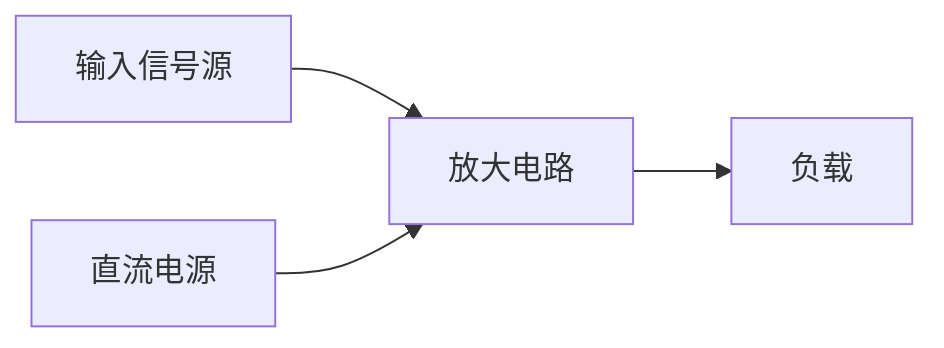
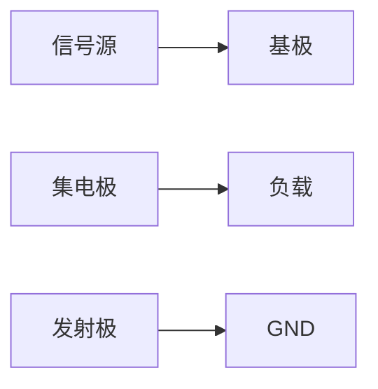

# week4-1-基本放大电路4

## 1. 放大电路基本概念
### 1.1 核心功能
- **能量控制**：以小能量信号控制大能量电源输出
- **核心指标**：
  - 电压增益 $A_v = \frac{V_o}{V_i}$
  - 电流增益 $A_i = \frac{I_o}{I_i}$
  - 功率增益 $A_p = A_v \cdot A_i$

### 1.2 放大电路组成

## 2. 静态工作点分析
### 2.1 基本概念
- **定义**：无输入信号时的直流工作状态
- **关键参数**：
$$ 
\begin{align}
I_{CQ} &= \beta I_{BQ} \\
V_{CEQ} &= V_{CC} - I_{CQ}(R_C + R_E)
\end{align}
$$

### 2.2 图解法分析
| 参数        | 计算公式                     | 物理意义               |
|-------------|-----------------------------|-----------------------|
| 直流负载线  | $V_{CE} = V_{CC} - I_C R_C$ | 确定静态工作点位置     |
| 交流负载线  | $V_{ce} = -i_c R_L'$        | 决定动态工作范围       |

## 3. 动态参数分析
### 3.1 微变等效电路

$$r_{be} = r_{bb'} + (1 + \beta) \frac{26mV}{I_{EQ}}$$

### 3.2 电压增益推导
1. 输入回路：

$$ v_i = i_b r_{be}$$
   
1. 输出回路：
 
$$   v_o = -\beta i_b (R_C // R_L)$$
   
1. 电压增益：

$$   A_v = \frac{v_o}{v_i} = -\beta \frac{R_C // R_L}{r_{be}}$$
   

## 4. 典型电路分析
### 4.1 共射极放大电路

**关键参数**：
$$
\begin{align}
R_i &= R_B // r_{be} \\
R_o &= R_C \\
A_v &= -\frac{\beta R_L'}{r_{be}}
\end{align}
$$

### 4.2 分压式偏置电路
$$
\begin{align}
V_B &= \frac{R_{B1}}{R_{B1}+R_{B2}} V_{CC} \\
V_E &= V_B - V_{BEQ} \\
I_{EQ} &= \frac{V_E}{R_E}

\end{align}
$$

## 5. 频率响应特性
### 5.1 低频响应
| 极点来源   | 时间常数公式              |
|------------|--------------------------|
| 输入耦合   | $\tau_1 = (R_B // r_{be})C_1$ |
| 输出耦合   | $\tau_2 = (R_C + R_L)C_2$ |

### 5.2 高频响应

$$f_H = \frac{1}{2\pi (r_{bb'} + R_{eq}) C_{b'e}}$$

## 6. 多级放大电路
### 6.1 级联方式
- **阻容耦合**：各级静态工作点独立
- **直接耦合**：低频特性好，存在零点漂移

### 6.2 总增益计算

$$A_{v总} = \prod_{i=1}^n A_{vi} \cdot \prod_{j=1}^{n-1} \frac{R_{ij}}{R_{oj} + R_{ij}}$$

## 7. 常见问题分析
### 7.1 失真现象
- **截止失真**：Q点过低 → 负半周削波
- **饱和失真**：Q点过高 → 正半周削波

### 7.2 稳定性改进

$$S = \frac{\partial I_C}{\partial \beta}  \quad \text{改进方案：} \quad S' = \frac{S}{1 + \frac{R_E}{r_{be}}}$$

