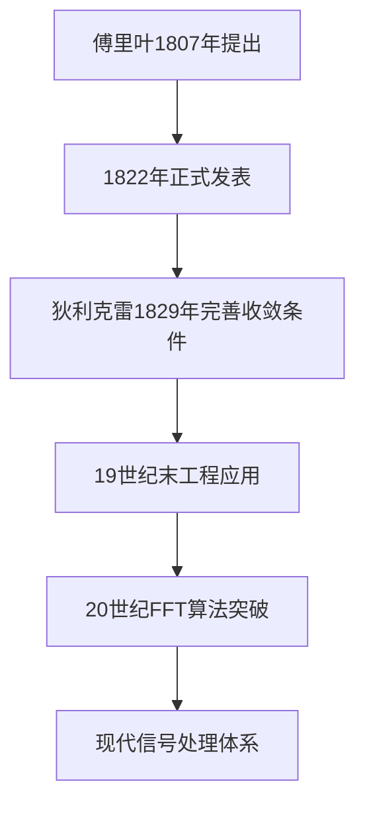

# 信号与系统：傅里叶分析核心总结

  

## 一、信号频谱分析基础

### 1.1 傅里叶分析框架


\boxed{

\begin{aligned}

&\text{时域} \quad f(t) \quad \xrightarrow{\text{FT}} \quad F(\omega) \quad \text{频域} \\

&\text{周期信号} \quad \xrightarrow{\text{FS}} \quad \text{离散频谱} \\

&\text{非周期信号} \quad \xrightarrow{\text{FT}} \quad \text{连续频谱}

\end{aligned}

}


  

### 1.2 正交函数集合理论

**正交性验证**：

```math

\int_{t_0}^{t_0+T} \cos(n\omega_1 t) \cdot \cos(m\omega_1 t) dt =

\begin{cases}

0, & n \neq m \\

T/2, & n = m \neq 0 \\

T, & n = m = 0

\end{cases}

```

  

**分解公式**：

  

$$

f(t) = a_0 + \sum_{n=1}^{\infty} \left[ a_n \cos(n\omega_1 t) + b_n \sin(n\omega_1 t) \right]

$$

其中：

  

$$

a_0 = \frac{1}{T} \int_{t_0}^{t_0+T} f(t)dt \\

a_n = \frac{2}{T} \int_{t_0}^{t_0+T} f(t)\cos(n\omega_1 t)dt \\

b_n = \frac{2}{T} \int_{t_0}^{t_0+T} f(t)\sin(n\omega_1 t)dt

$$

  

## 二、傅里叶级数（FS）应用

### 2.1 典型周期信号分析

#### 周期方波信号

  

$$

f(t) = \frac{4E}{\pi} \sum_{k=0}^{\infty} \frac{1}{2k+1} \sin[(2k+1)\omega_1 t]

$$

**频谱特征**：

| 谐波次数 | 幅度衰减规律 | 相位特性 |

| -------- | ------------ | -------- |

| 奇数次   | $1/n$        | 交替反相 |

| 偶数次   | 0            | -        |

  

#### 周期三角波信号

  

$$

f(t) = \frac{8E}{\pi^2} \sum_{k=0}^{\infty} \frac{(-1)^k}{(2k+1)^2} \cos[(2k+1)\omega_1 t]

$$

**频谱特征**：

| 谐波次数 | 幅度衰减规律 | 对称性 |

| -------- | ------------ | ------ |

| 奇数次   | $1/n^2$      | 偶对称 |

| 偶数次   | 0            | -      |

  

### 2.2 Gibbs现象

**关键结论**：

- 在不连续点附近出现9%的过冲

- 过冲幅度不随谐波数增加而减小

- 收敛于间断点的中值

  

## 三、傅里叶变换（FT）核心性质

### 3.1 基本变换对

  

$$

\begin{aligned}

\mathcal{F}\{\delta(t)\} &= 1 \\

\mathcal{F}\{e^{-at}u(t)\} &= \frac{1}{a+j\omega} \\

\mathcal{F}\{\cos(\omega_0 t)\} &= \pi[\delta(\omega-\omega_0)+\delta(\omega+\omega_0)]

\end{aligned}

$$

  

### 3.2 重要性质表

| 性质     | 时域                  | 频域                        |

| -------- | --------------------- | --------------------------- |

| 线性性   | $af(t)+bg(t)$         | $aF(\omega)+bG(\omega)$     |

| 时移     | $f(t-t_0)$            | $F(\omega)e^{-j\omega t_0}$ |

| 频移     | $f(t)e^{j\omega_0 t}$ | $F(\omega-\omega_0)$        |

| 对称性   | $F(t)$                | $2\pi f(-\omega)$           |

| 时域微分 | $f'(t)$               | $j\omega F(\omega)$         |

| 频域微分 | $tf(t)$               | $jF'(\omega)$               |

| 卷积定理 | $f(t)*g(t)$           | $F(\omega)G(\omega)$        |

  

### 3.3 帕塞瓦尔定理

  

$$

\int_{-\infty}^{\infty} |f(t)|^2 dt = \frac{1}{2\pi} \int_{-\infty}^{\infty} |F(\omega)|^2 d\omega

$$

  

## 四、周期信号的傅里叶变换

### 4.1 基本公式

  

$$

\mathcal{F}\left\{ \sum_{n=-\infty}^{\infty} F_n e^{jn\omega_1 t} \right\} = 2\pi \sum_{n=-\infty}^{\infty} F_n \delta(\omega - n\omega_1)

$$

  

### 4.2 典型案例：周期冲激串

  

$$

\mathcal{F}\left\{ \sum_{n=-\infty}^{\infty} \delta(t-nT) \right\} = \frac{2\pi}{T} \sum_{k=-\infty}^{\infty} \delta(\omega - k\omega_s)

$$

其中 $\omega_s = \frac{2\pi}{T}$

  

## 五、对称性应用实例

### 5.1 矩形脉冲与Sa函数

  

$$

\begin{aligned}

\text{时域矩形脉冲} &\quad \text{rect}(t/\tau) \quad \xrightarrow{\mathcal{F}} \quad \tau \text{Sa}(\frac{\omega \tau}{2}) \\

\text{频域矩形脉冲} &\quad \tau \text{Sa}(\frac{t \tau}{2}) \quad \xrightarrow{\mathcal{F}} \quad 2\pi \text{rect}(-\omega/\tau)

\end{aligned}

$$

  

## 六、收敛条件（Dirichlet条件）

1. 绝对可积：$\int_{-\infty}^{\infty} |f(t)|dt < \infty$

2. 有限个极大值/极小值

3. 有限个不连续点

4. 不连续点处收敛于左右极限的平均值

  

## 七、数学推导关键步骤

### 7.1 傅里叶变换对称性证明

  

$$

\text{已知} \quad f(t) = \frac{1}{2\pi} \int_{-\infty}^{\infty} F(\omega)e^{j\omega t} d\omega \\

\text{将} t \leftrightarrow \omega \text{互换得} \\

F(t) = \frac{1}{2\pi} \int_{-\infty}^{\infty} f(-\omega)e^{j\omega t} d\omega \\

\Rightarrow \mathcal{F}\{F(t)\} = 2\pi f(-\omega)

$$

  

### 7.2 周期信号FT推导

  

$$

\begin{aligned}

f_T(t) &= \sum_{n=-\infty}^{\infty} F_n e^{jn\omega_1 t} \\

\mathcal{F}\{f_T(t)\} &= \sum_{n=-\infty}^{\infty} F_n \mathcal{F}\{e^{jn\omega_1 t}\} \\

&= 2\pi \sum_{n=-\infty}^{\infty} F_n \delta(\omega - n\omega_1)

\end{aligned}

$$

  

## 八、典型信号频谱特征表

| 信号类型 | 频谱特性                        | 衰减规律     | 对称性 |

| -------- | ------------------------------- | ------------ | ------ |

| 直流信号 | 单位冲激                        | -            | 偶     |

| 冲激信号 | 均匀谱                          | -            | 偶     |

| 阶跃信号 | $1/j\omega + \pi\delta(\omega)$ | $1/\omega$   | 奇     |

| 矩形脉冲 | Sa函数                          | $1/\omega$   | 偶     |

| 三角脉冲 | Sa²函数                         | $1/\omega^2$ | 偶     |

  

## 九、应用注意事项

1. **时域-频域不确定性原理**：

  

$$

\Delta t \cdot \Delta \omega \geq \frac{1}{2}

$$

2. **系统分析核心公式**：

  

$$

y(t) = \mathcal{F}^{-1}\{ Y(\omega) \} = \mathcal{F}^{-1}\{ X(\omega)H(\omega) \}

$$

其中 $H(\omega)$ 为系统频率响应

  

## 十、历史发展脉络



```