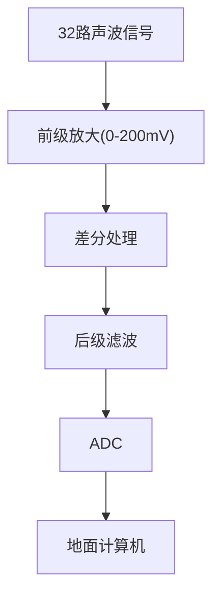

# 第三章 集成运算放大电路

## 1. 多级放大电路的耦合方式及分析
### 1.1 耦合方式及特点
- **直接耦合**：前后级直连，低频特性好，但存在零点漂移问题
- **阻容耦合**：通过电容连接，隔离直流，但低频响应受限
- **变压器耦合**：通过磁耦合传递信号，效率高但体积大

### 1.2 多级放大电路分析
- **电压放大倍数**：$A_u = \prod A_{ui}$（各级增益相乘）
- **输入/输出电阻**：
  - 输入电阻 $R_i = R_{i1}$
  - 输出电阻 $R_o = R_{on}$

---

## 2. 差分放大电路
### 2.1 基本特性
- **差模信号**：$u_{Id} = u_{I1} - u_{I2}$
- **共模信号**：$u_{Ic} = \frac{u_{I1} + u_{I2}}{2}$
- **共模抑制比**：$K_{CMR} = \left| \frac{A_d}{A_c} \right|$

### 2.2 有源负载差分放大电路
- **动态分析**：
  - 输出电流变化：$\Delta i_O = 2\Delta i = g_m \Delta u_{Id}$
  - 电压增益：$A_d = \frac{\Delta u_{Od}}{\Delta u_{Id}} = g_m \cdot (R_L // r_{ds})$

---

## 3. 电流源电路
### 3.1 镜像电流源
- **工作原理**：通过匹配晶体管参数实现电流镜像
- **公式推导**：$I_{C2} \approx I_{C1} = \frac{V_{CC} - V_{BE}}{R}$

### 3.2 有源负载应用
- **共射放大电路**：
  - 动态电阻 $r_{ce2} \uparrow$ → 电压增益 $|A_u| \uparrow$
  - 增益公式：$A_u = -\beta \cdot \frac{R_c // R_L}{r_{be} + R_b}$

---

## 4. 互补输出级电路（OCL电路）
### 4.1 交越失真消除
- **二极管补偿**：利用二极管压降提供偏置电压
- **UBE倍增电路**：通过电阻分压动态调整基极偏置

### 4.2 工作原理
- **甲乙类工作状态**：$I_{CQ} \approx 0.7V / R_E$
- **输出功率**：$P_o = \frac{V_{CC}^2}{2R_L}$

---

## 5. 集成运放性能指标
| 指标              | 公式/定义                                   | 意义           |     |
| --------------- | --------------------------------------- | ------------ | --- |
| 开环差模增益 $A_{od}$ | $20\lg(A_{od})$ (dB)                    | 直流增益通常>100dB |     |
| 共模抑制比 $K_{CMR}$ | $K_{CMR} =  \frac{A_d}{A_c}$            | 抗共模干扰能力      |     |
| 转换速率 SR         | $SR = \max \frac{\Delta u_o}{\Delta t}$ | 动态响应速度       |     |
| 输入失调电压 $U_{IO}$ | $U_{IO} =U_P - U_{N_{u_o=0}}$           | 衡量温漂特性       |     |

---

## 6. 集成运放电路分析方法
### 6.1 分析步骤
1. **合理分块**：输入级→中间级→输出级
2. **功能分析**：差分对管、有源负载、互补输出等模块
3. **静态计算**：确定各级工作点（如$I_{CQ}, V_{CEQ}$）
4. **动态计算**：使用微变等效电路求$A_u, R_i, R_o$

### 6.2 典型电路参数

$$
A_{u1} = -\beta_1 \cdot \frac{r_{ce2} // R_L}{r_{be1} + R_b}
$$
$$
A_{u2} = \beta_2 \cdot (r_{ce3} // R_L)
$$

---

## 7. 实际应用电路示例
### 7.1 高温声波测井仪器信号链

### 7.2 激光前置放大电路
- **核心设计**：
  - 高输入阻抗： $R_i > 10M\Omega$
  - 低噪声：选用 JFET 输入级
  - 带宽： $f_{-3dB} = 10MHz$
$$
A_u = \frac{R_2}{R_1} \cdot \left(1 + \frac{R_3}{R_4}\right)
$$

---

## 8. 发展历程与分类

| 代际   | 特点           | 代表型号 |
| ------ | -------------- | -------- |
| 第一代 | 分立元件集成化 | μA709    |
| 第二代 | 采用有源负载   | F007     |
| 第三代 | 超β管输入级    | OP-07    |
| 第四代 | 斩波稳零技术   | HA2900   |

**现代分类**：
- 按工艺：BJT/MOS/BiCMOS
- 按功能：通用型/高精度/高速/高压
- 按输入：轨到轨 (Rail-to-Rail)
